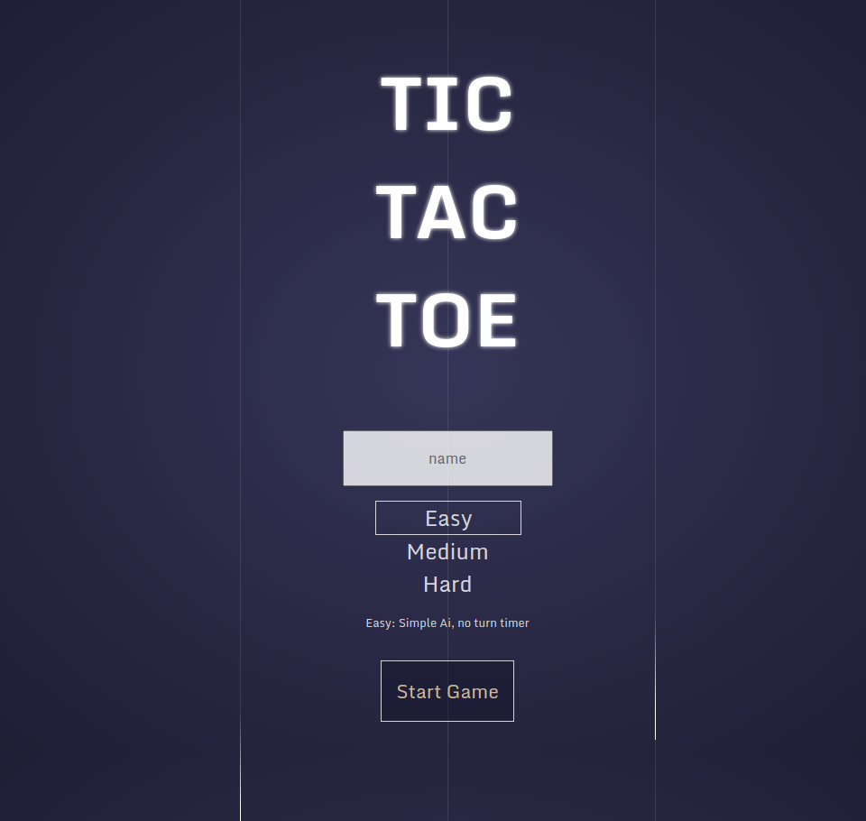

# Tic-Tac-Toe

## Screenshots

## Controls

1. Enter your name
2. Choose a difficulty setting
3. Click start games

## Outstanding issues

- responsiveness has some issues at smaller screen
- add win/loss counter
- store that data locally
- select your own icon
